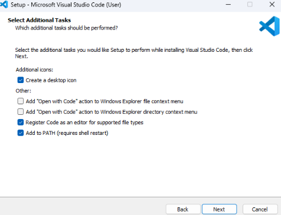
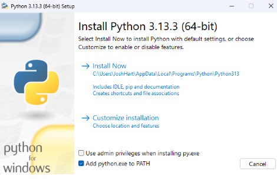

# 🛠️ Installation Guide

A step-by-step guide to install the essential tools for development: VS Code, Python, Git, and GitHub.

---

## 1. VS Code

### 🔗 Download Link:
[Download VS Code](https://code.visualstudio.com/)

### 🖼️ Installation Steps:
1. Go to the VS Code website.
2. Click on **Download for Windows/Mac/Linux**.
3. Run the installer and follow the prompts.

> *Image: Clicking the "Download for Windows" button on the VS Code website*

---

## 2. Python

### 🔗 Download Link:
[Download Python](https://www.python.org/downloads/)

### 🖼️ Installation Steps:
1. Visit the Python downloads page.
2. Click the latest version for your OS.
3. Make sure to check **"Add Python to PATH"** before installing.

> *Image: Important step - adding Python to PATH*

---

## 3. GitHub

### 🔗 Sign-Up Link:
[Create a GitHub Account](https://github.com/join)

### 🖼️ Sign-Up Steps:
1. Open the GitHub join page.
2. Fill in your username, email, and password.
3. Verify your email to complete sign-up.

> *Image: GitHub registration form*

---

## 4. Git

### 🔗 Download Link:
[Download Git](https://git-scm.com/downloads)

### 🖼️ Installation Steps:
1. Download the Git installer for your OS.
2. Run the setup and keep the default options (recommended).
3. Open git.
4. Input these each of these two with your own github username and email.

git config --global user.name "John Doe"
git config --global user.email johndoe@example.com

---

## 5. Enable AutoSave in VS Code

### 📌 Steps:
1. Open VS Code.
2. Go to **File → Auto Save**.
3. Alternatively, go to **Settings (Ctrl + ,)** and search for "Auto Save".

> *Image: Enabling Auto Save from the File menu*

---

## 📦 Tips

- Use VS Code extensions like Python, GitLens.
- Set up SSH for GitHub to push code without entering credentials every time.
- Make sure to restart VS Code after installations.

---

## 📁 Image Tips

- Store images in a folder like `images/` inside your repo.
- Use relative paths like ``.

---